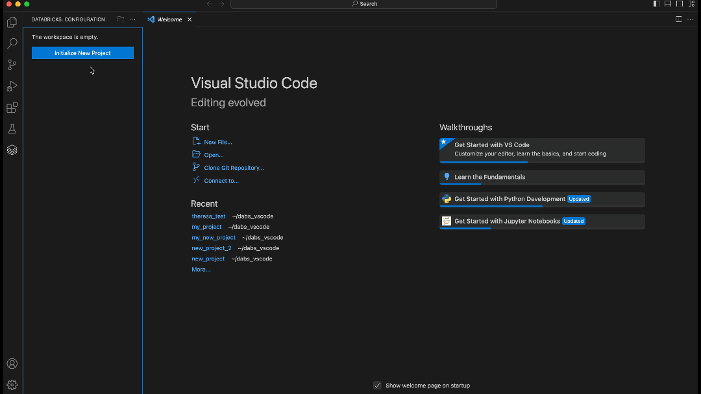

# ⚠️ Note

# Databricks Extension for Visual Studio Code

The Databricks extension for VS Code allows you to develop for the Databricks Lakehouse platform from VS Code.

> 📘 **Note**: The [User Guide](https://docs.databricks.com/dev-tools/vscode-ext.html) contains comprehesive documentation about the Databricks extension.

# Features

-   Create a Databricks Project [Databricks Asset Bundle]()
-   Manage, run and deploy Databricks assets (jobs, DLT Pipelines)
-   Synchronize code to a Databricks workspace
-   Run Python files on a Databricks cluster
-   Run notebooks and Python files as Workflows
-   Debug Spark code running on a Databricks cluster using Databricks Connect
-   Run notebooks cell by cell using Databricks Connect

## Table of Contents

-   [Getting Started](#setup-steps)
    -   [Create a Databricks Project](#create-databricks-project)
    -   [Running Code](#running-code)
        -   [Running PySpark Code](#running-pyspark-code)
        -   [Running PySpark Code and Notebooks as Workflows](#running-code-as-workflows)
    -   [Deploying Databricks Asset Bundle](#dabs)
        -   [What is a Databricks Asset Bundle?](#what-is-dab)
        -   [Deploying a Databricks Asset Bundle](#deploy-dab)
        -   [Run a Job or Pipeline](#deploy-run-job-pipeline)
-   [Changes from v1](#changes-from-v1)
    -   [Migrate a project from Databricks Extension v1 to v2](#migrate-from-v1)
    -   [What is databricks.yml?](#what-is-databricksyaml)
    -   [No environment variables in terminals](#no-env-vars)

---

# Getting Started

## Create a Databricks Project

1. Open the Databricks panel by clicking on the Databricks icon on the left
2. Click on the "Create a new Databricks Project" button.
3. Follow the wizard to select an existing Databricks Profile or create a new one.
4. Select a folder to create your project in.
5. Follow the wizard to create a new Databricks Project.
6. Select the newly created project to open it, using the selector that appears.
7. VS Code will reopen with the new project loaded, and the extension will automatically login using the selected profile.

If your folder has multiple [Databricks Asset Bundles](#dabs), you can select which one to use by clicking "Open Existing Databricks Project" button and selecting the desired project.

## Select a cluster

The extension uses an interactive cluster to run code. To select an interactive cluster

1. Open the Databricks panel by clicking on the Databricks icon on the left
2. Click on the "Select Cluster" button.
    - If you wish to change the selected cluster, click on the "Configure Cluster" gear icon, next to the name of the selected cluster.

## Running Code

Once you have your project configured you can deploy your local code to the repo and run it on a cluster.

### Running PySpark code

1. Create python file
2. Add PySpark code to the python file.
3. Click the "Databricks Run" icon in the tab bar and select "Upload and Run File on Databricks"

This will deploy the code to the selected Databricks workspace and run it on the cluster. The result is printed in the "debug" output panel.

### Running PySpark and notebooks as a Workflow

1. Create a python file or a python based notebook
    1. You can create a python based notebook by exporting a notebook from the Databricks web application or use a notebook that is already tracked in git, such as https://github.com/databricks/notebook-best-practices
2. Click the "Databricks Run" icon in the tab bar and select "Run File as Workflow on Databricks"

This will run the file using the Jobs API on the configured cluster and render the result in a WebView.

## Deploying Databricks Asset Bundle

### What is a Databricks Asset Bundle?

Databricks Asset Bundles make it possible to describe Databricks resources such as jobs, pipelines, and notebooks as source files. These source files provide an end-to-end definition of a project, including how it should be structured, tested, and deployed, which makes it easier to collaborate on projects during active development. For more information, see [Databricks Asset Bundle](https://docs.databricks.com/en/dev-tools/bundles/index.html).

### Deploying a Databricks Asset Bundle?

1. In the Databricks panel, look for the "Bundle Resource Explorer" view.
2. Click on the "Deploy" button.
3. You can monitor the deployment status in the log output window.

### Run a Job or Pipeline

You can run a job or a pipeline managed by Databricks Asset Bundles, from the "Bundle Resource Explorer" view.

1. In the Databricks panel, look for the "Bundle Resource Explorer" view.
2. Hover on the line with the job or pipeline you want to run.
3. Click on the "Run" button.

This will deploy the Databricks Asset Bundle and run the job or pipeline. You can monitor the run progress in the output terminal window. You can also open the run, job or pipeline in workspace by clicking on the "Open link externally" button.

#### Use interactive cluster for running jobs

By default, a job is run using a jobs cluster. You can change this behaviour and use the interactive cluster selected previously ([Select a cluster](#select-cluster)) to run the job.

1. In the Databricks panel, look for the "Configuration" view.
2. Check the "Override Jobs cluster in bundle" checkbox.

#  Key behaviour changes for users of Databricks Extension v1

## Migrate a project from Databricks Extension v1 to v2

If you are using Databricks Extension v1, will automatically migrate your project to v2 when you open it in v2. The migration process will create a new [`databricks.yml`](#what-is-databricksyaml) file in the root of your project and move the configurations from the old `.databricks/project.json` to the new `databricks.yml` file.

> **Note**: This means that you will start seeing a `databricks.yml` file in your project root directory and in your VCS change logs. We recomment comitting this file to your VCS.

## What is databricks.yaml?

A `databricks.yml` file is a configuration file that describes a Databricks Asset Bundle. It contains the configurations such as the workspace host and description of resources such as jobs and piplines. For more information on `databricks.yml`, refer to the [full docs](https://docs.databricks.com/en/dev-tools/bundles/work-tasks.html#create-a-bundle-manually).

## No environment variables in terminals

We don't support environment variables in terminals anymore. If you were using environment variables in v1, you will need to manually load the `.databricks/.databricks.env` file in your terminal before running any commands.
