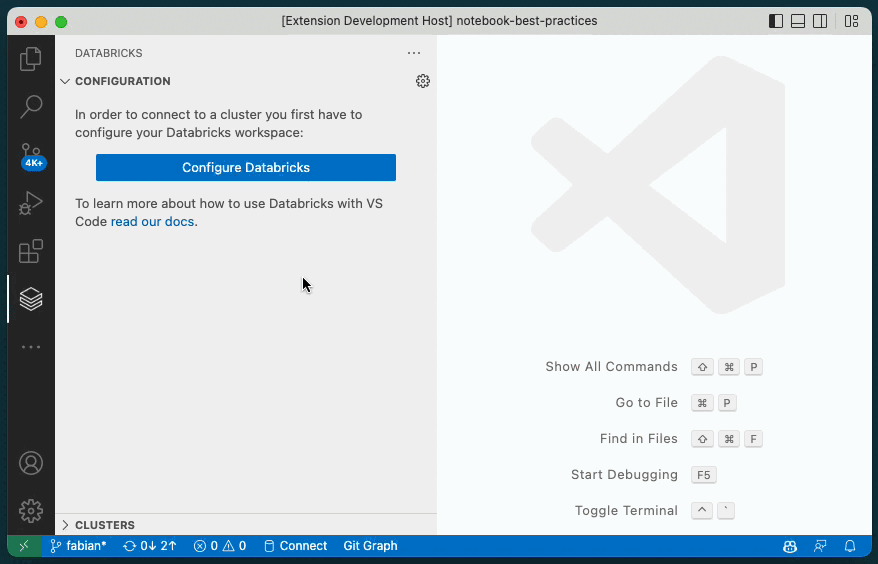
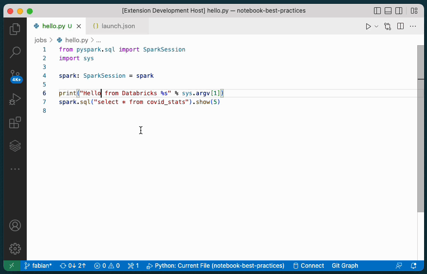

# ⚠️ Note

> **The quickstart guide for `2.*.*` version of the extension is still work-in-progress. For now, please use the documentation we provided to you. Please reach out to your Databricks representative if you don't have access to the relevant docs.**

# Databricks Extension for Visual Studio Code

The Databricks extension for VS Code allows you to develop for the Databricks Lakehouse platform from VS Code.

> 📘 **Note**: The [User Guide](https://docs.databricks.com/dev-tools/vscode-ext.html) contains comprehesive documentation about the Databricks extension.

# Features

-   Synchronize code to a Databricks workspace
-   Run Python files on a Databricks cluster
-   Run notebooks and Python files as Workflows

## Table of Contents

-   [Getting Started](#setup-steps)
    -   [Configure Extension](#configure-extension)
    -   [Running Code](#running-code)
        -   [Running PySpark Code](#running-pyspark-code)
        -   [Running PySpark Code and Notebooks as Workflows](#running-code-as-workflows)
        -   [Advanced: Running using custom run configurations](#run-configurations)
-   [Extension Settings](#settings)
-   [`Databricks:` Commands](#commands)

---

# Getting Started

## Configure Extension

1. Open the Databricks panel by clicking on the Databricks icon on the left
2. Click the "Configure Databricks" button
3. Follow the wizard to select or configure a CLI profile
4. Click the "gear" icon in the clusters tree item to select an interactive cluster for running code on
    1. You can also select the first entry in the list to create a new cluster. Selecting the item will take you into the Databricks web application.
    2. We recommend creating a Personal Compute Cluster.
5. Click the "gear" icon in the Repo tree item to select a repo to sync code to
    1. You can also select the first entry in the list to create a new Databricks repo

## Running Code

Once you have your project configured you can sync your local code to the repo and run it on a cluster. You can use the https://github.com/databricks/ide-best-practices repository as an example.

### Running PySpark code

1. Create python file
2. Add PySpark code to the python file.
3. Click the "Run" icon in the tab bar and select "Upload and Run File on Databricks"

This will start the code synchronization and run the active python file on the configured cluster. The result is printed in the "debug" output panel.

### Running PySpark and notebooks as a Workflow

1. Create a python file or a python based notebook
    1. You can create a python based notebook by exporting a notebook from the Databricks web application or use a notebook that is already tracked in git, such as https://github.com/databricks/notebook-best-practices
2. Click the "Run" icon in the tab bar and select "Run File as Workflow on Databricks"

This will run the file using the Jobs API on the configured cluster and render the result in a WebView.

### Advanced: Running using custom run configurations

Both ways of running code on a cluster are also available in custom run configurations. In the "Run and Debug" panel you can click "Add configuration..." and select either "Databricks: Launch" or "Databricks: Launch as Workflow". Using run configuration you can also pass in command line arguments and run your code by simply pressing `F5`.

## Extension Settings

This extension contributes the following settings:

-   `databricks.logs.maxFieldLength`: The maximum length of each field displayed in logs outputs panel
-   `databricks.logs.truncationDepth`: The max depth of logs to show without truncation
-   `databricks.logs.maxArrayLength`: The maximum number of items to show for array fields
-   `databricks.logs.enabled`: Enable/disable logging. Reload window for changes to take effect
-   `databricks.clusters.onlyShowAccessibleClusters`: Only show clusters that the user has access to

## `Databricks:` Commands

The Databricks extension provides commands (prefixed with `Databricks:`) to the VS Code _command
palette_, available by selecting _View > Command Palette_ or by typing
`CTRL-SHIFT-p` (macOS: `CMD-SHIFT-p`).

| Databricks Command                               | Description                                                                                                                          |
| :----------------------------------------------- | :----------------------------------------------------------------------------------------------------------------------------------- |
| `Databricks: Configure workspace`                | Configure the Databricks workspace to use for the current project                                                                    |
| `Databricks: Logout`                             | Logs you out from your Databricks workspace                                                                                          |
| `Databricks: Configure cluster`                  | Select an interactive cluster to use for running PySpark code in this project                                                        |
| `Databricks: Detach cluster`                     | Detach configured cluster                                                                                                            |
| `Databricks: Configure sync destination`         | Configure target directory for synchronizing code to the configured Databricks workspace                                             |
| `Databricks: Detach sync destination`            | Detach the configured sync destination                                                                                               |
| `Databricks: Start synchronization`              | Start synchronizing local code to the Databricks workspace. This command performs an incremental sync.                               |
| `Databricks: Start synchronization (full sync)`  | Start synchronizing local code to the Databricks workspace. This command performs full sync even if an incremental sync is possible. |
| `Databricks: Stop synchronization`               | Stop sync process.                                                                                                                   |
| `Databricks: Upload and Run File on Databricks`  | Runs the selected Python file on the configured Databricks cluster                                                                   |
| `Databricks: Run File as Workflow on Databricks` | Runs the selected Python file as a Workflow in the configured Databricks cluster                                                     |
| `Databricks: Show Quickstart`                    | Show the Quickstart panel                                                                                                            |
| `Databricks: Open Databricks configuration file` | Opens the Databricks configuration file for the current project                                                                      |
| `Databricks: Open full log`                      | Opens the log output folder for the current project                                                                                  |
