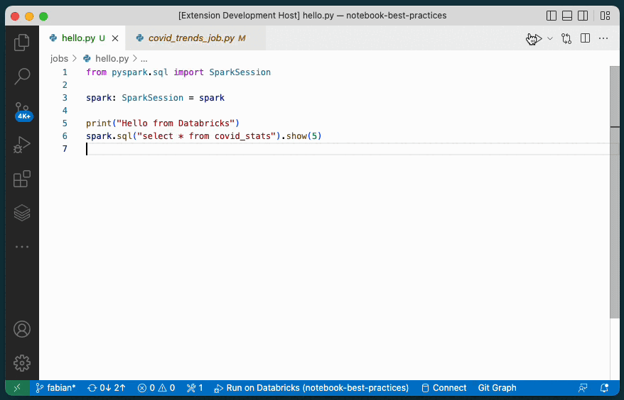

# Databricks extension for Visual Studio Code

The Databricks extension for VS Code allows you to develop for the Databricks Lakehouse platform from VS Code.

The extension is available from the [Visual Studio Marketplace](https://marketplace.visualstudio.com/itemdetails?itemName=databricks.databricks-vscode).

This is an open source project because we want you to be involved. We love issues, feature requests, code reviews, pull requests or any positive contribution. See [CONTRIBUTING.md](CONTRIBUTING.md).

## Features

-   Synchronize code to a Databricks workspace
-   Run Python files on a Databricks cluster
-   Run notebooks and Python files as Workflows

<!--
Comment out until the repo is public so the image can be loaded by the marketplace

-->

## Requirements

In order to use this extension you need acceess to a Databricks workspace:

1. Databricks workspace with:
    1. `Repos` enabled
    2. `Files in Repos` enabled
2. Permission to access the workspace using a personal access token (PAT)
3. Access to an interactive cluster or permissions to create a cluster
4. Permissions to create Databricks repos

## Documentation

<!--
Comment out until the repo is public so the image can be loaded by the marketplace

-   The [Quick Start Guide](README.quickstart.md) provides an overview
    of common features.
-->

-   The [User Guide](https://docs.databricks.com/dev-tools/vscode-ext.html)
    contains comprehesive documentation about the Databricks extension.

## Release Notes

### 0.0.1

Preview version of the VS Code extension for Databricks

**Happy Coding!**
