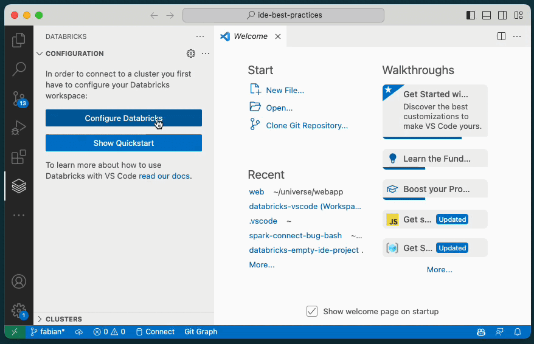

# Databricks Extension for VSCode

The Databricks extension for VSCode allows you to develop for the Databricks Lakehouse platform from VSCode.

# Features

-   Synchronize code to a Databricks workspace
-   Run Python files on a Databricks cluster
-   Run notebooks and Python files as Workflows

---

# Getting Started

## Configure Extension

1. Open the Databricks panel by clicking on the Databricks icon on the left
2. Click the "Configure Databricks" button
3. Follow the wizard to select or configure a CLI profile
4. Click the "gear" icon in the clusters tree item to select an interactive cluster for running code on
    1. You can also select the first entry in the list to create a new cluster. Selecting the item will take you into the Databricks web application.
    2. We recommend creating a Personal Compute Cluster.
5. Click the "gear" icon in the Repo tree item to select a repo to sync code to
    1. You can also select the first entry in the list to create a new Databricks repo. Selecting the item will take you into the Databricks web application.
    2. We recommend to not configure a git remote for you repo and do all git operations from the IDE

## Running Code

Once you have your project configured you can sync your local code to the repo and run it on a cluster. You can use the https://github.com/databricks/ide-best-practices repository as an example.

### Running PySpark code

1. Create python file
2. Add PySpark code to the python file.
3. Click the "Run" icon in the tab bar and select "Run File on Databricks"

This will start the code synchronization and run the active python file on the configured cluster. The result is printed in the "debug" output panel.

### Running PySpark and notebooks as a Workflow

1. Create a python file or a python based notebook
    1. You can create a python based notebook by exporting a notebook from the Databricks web application or use a notebook that is already tracked in git, such as https://github.com/databricks/notebook-best-practices
2. Click the "Run" icon in the tab bar and select "Run File as Workflow on Databricks"

This will run the file using the Jobs API on the configured cluster and render the result in a WebView.

### Advanced: Running using custom run configurations

Both ways of running code on a cluster are also available in custom run configurations. In the "Run and Debug" panel you can click "Add configuration..." and select either "Databricks: Launch" or "Databricks: Launch as Workflow". Using run configuration you can also pass in command line arguments and run your code by simply pressing `F5`.

