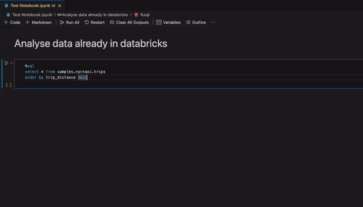
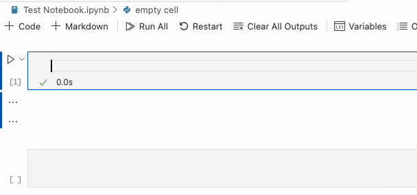
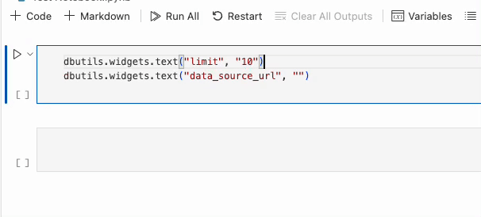
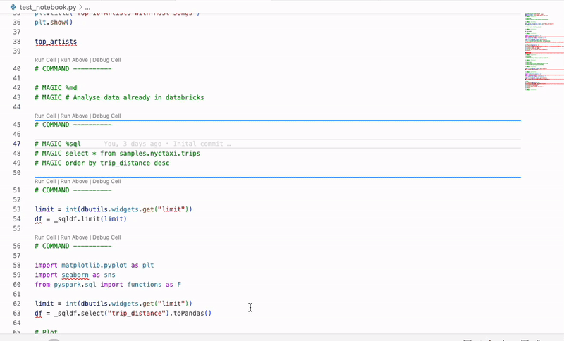

# <!-- DATABRICKS LOGO --> Databricks Extension v1.2

## What's new?

-   [📗 Advanced notebook support with Databricks Connect V2](#dbconnect-notebook)

##  Advanced notebook support with Databricks Connect V2

You could already run notebooks locally using Databricks Connect V2. But we are now introducing advanced notebook support which enables you to run notebooks locally with the similar experience as running them on a Databricks cluster. The aim of this update is to bring most of the convenience of running notebooks on a Databricks cluster to your local environment!

This includes:

-   [Magic commands such as `%run` and `%sql` etc](#magic-commands)
-   [Preconfigured globals such as spark and dbutils](#preconf-globals)
-   [Interactive `dbutils.widgets`](#widgets)
-   [Support for Databricks Notebooks](#dbnb)

### Magic commands

You can now use Databricks magic commands locally from your notebooks.

See [here]() for a list of supported magic commands.

### Preconfigured globals

Just like on a Databricks cluster, we configure and provide you with some globals such as `spark` and `dbutils` when you run notebooks locally.

See [here]() for a list of supported globals.

### Interactive `dbutils.widgets`

You can now use `dbutils.widgets` to create interactive widgets in your local notebooks.

See [here]() for a list of requirements.

### Support for Databricks notebooks

You can use Databricks notebooks locally with [VS Code Interactive Windows](https://code.visualstudio.com/docs/python/jupyter-support-py).

See [here]() for more details.

