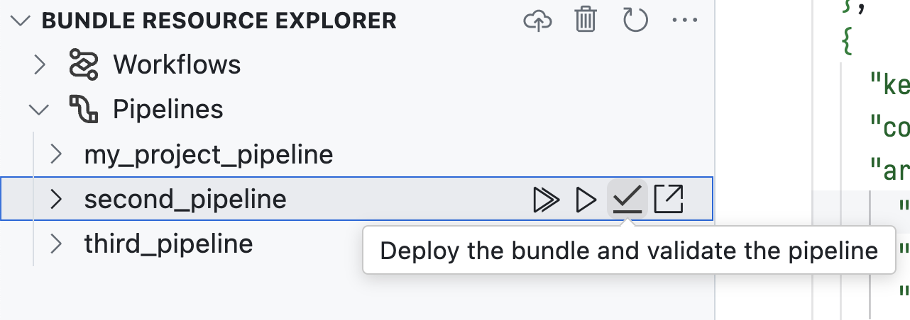

# Databricks Extension v2.5.0

## What's new?

-   [Pipeline validation and partial update actions](#validation)
-   [Pipeline events and diagnostics](#events)
-   [Pipeline datasets](#datasets)
-   [Quick run action](#quick-run)

### <a id="validation"></a> Pipeline validation and partial update actions

In previous versions, you could only trigger a [Refresh all](https://docs.databricks.com/en/delta-live-tables/updates.html#how-dlt-updates) pipeline update. Now you can do validation and partial updates:



The partial update action preloads datasets from past runs, and lets you enter table names or select a full refresh:


### <a id="events"></a> Pipeline events and diagnostics

During and after a pipeline update, the extension now shows events in the resource explorer UI:


Any warnings or errors that have source locations are also displayed in the Visual Studio Code **PROBLEMS** panel and highlighted in the source files:


### <a id="datasets"></a> Pipeline datasets

You can now see pipeline datasets and their schemas in the extension resource explorer:


Datasets are gathered from the events of past runs, so make sure to update or validate your pipeline at least once.

### <a id="quick-run"></a> Quick run action

Previously, run and update actions were only available from the extension resource explorer UI. Now you can also use a new `Deploy the bundle and run a resource` command from the Command Palette:


By default, you select the resource to execute:


You can also specify a shortcut to run the command with specific arguments.

Open the keyboard shortcuts JSON using the command `Preferences: Open Keyboard Shortcuts (JSON)`. Add a new entry to the `keybindings` array:

```json
{
    // Replace with your desired shortcut
    "key": "ctrl+shift+x",
    "command": "databricks.bundle.deployAndRunFromInput",
    "args": {
        // "jobs" or "pipelines"
        "resourceType": "pipelines",
        // The key of the pipeline or job you want to run, as defined in your asset bundle configuration
        "resourceKey": "my_pipeline_key",
        // Any flags that will be passed to the "databricks bundle run" command
        "args": "--validate-only"
    }
}
```
